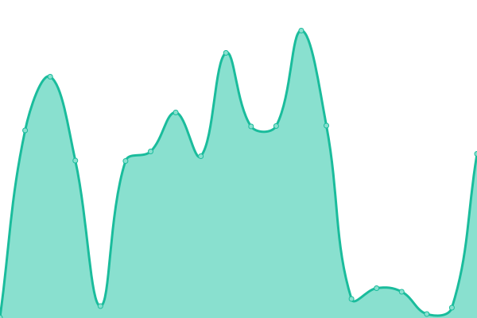

# [📈 Live Status](https://status.tavernarakis.eu): <!--live status--> **🟩 All systems operational**

This repository contains the open-source uptime monitor and status page for [Ioannis Tavernarakis](https://status.tavernarakis.eu).

<!--start: status pages-->
<!-- This summary is generated by Upptime (https://github.com/upptime/upptime) -->
<!-- Do not edit this manually, your changes will be overwritten -->
<!-- prettier-ignore -->
| URL | Status | History | Response Time | Uptime |
| --- | ------ | ------- | ------------- | ------ |
|  NAS | 🟩 Up | [nas.yml](https://github.com/Sakretsos/status.tavernarakis.eu/commits/HEAD/history/nas.yml) | 

 554ms
     
 | 

<a href="https://status.tavernarakis.eu/history/nas">100.00%</a>
    

|  ESXI1 | 🟩 Up | [esxi-1.yml](https://github.com/Sakretsos/status.tavernarakis.eu/commits/HEAD/history/esxi-1.yml) | 

 628ms
     
 | 

<a href="https://status.tavernarakis.eu/history/esxi-1">100.00%</a>
    

|  ESXI2 | 🟩 Up | [esxi-2.yml](https://github.com/Sakretsos/status.tavernarakis.eu/commits/HEAD/history/esxi-2.yml) | 

 493ms
     
 | 

<a href="https://status.tavernarakis.eu/history/esxi-2">100.00%</a>
    

|  ESXI3 | 🟩 Up | [esxi-3.yml](https://github.com/Sakretsos/status.tavernarakis.eu/commits/HEAD/history/esxi-3.yml) | 

 555ms
     
 | 

<a href="https://status.tavernarakis.eu/history/esxi-3">100.00%</a>
    

<!--end: status pages-->

[**Visit our status website →**](https://status.tavernarakis.eu)

## 📄 License

- Powered by: [Upptime](https://github.com/upptime/upptime)
- Code: [MIT](./LICENSE) © [Ioannis Tavernarakis](https://status.tavernarakis.eu)
- Data in the `./history` directory: [Open Database License](https://opendatacommons.org/licenses/odbl/1-0/)
